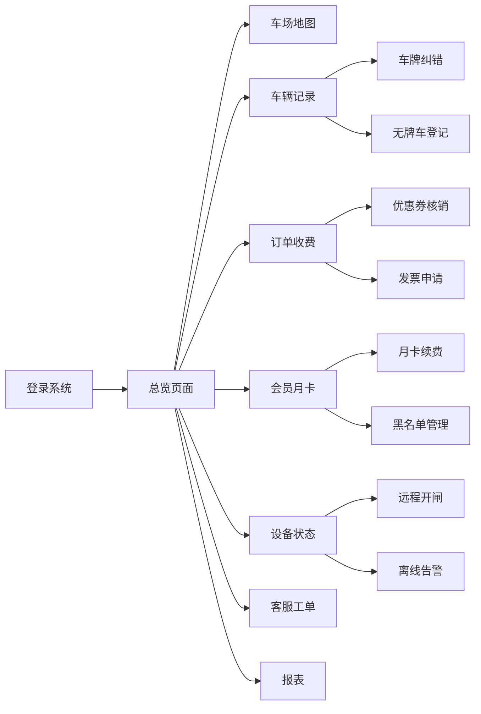

## 1. 产品概述
商场智慧停车运营管理系统，为停车场经理和客服人员提供一站式车位管理、收费运营与异常处理平台。通过可视化界面实现实时车位监控、车辆管理、订单收费、会员运营、设备运维和数据分析，提升停车场运营效率与服务质量。

## 2. 核心功能

### 2.1 用户角色
| 角色 | 登录方式 | 核心权限 |
|------|----------|----------|
| 停车场经理 | 账号密码登录 | 全部功能权限，包含报表查看、设备管理、黑名单管理 |
| 客服人员 | 账号密码登录 | 车辆记录处理、订单收费、工单处理、月卡办理 |

### 2.2 功能模块
1. **总览**：实时空位统计、今日运营数据、近期趋势概览
2. **车场地图**：分区车位分布图、余位实时展示、车位状态可视化
3. **车辆记录**：入出场记录查询、车牌纠错、无牌车登记
4. **订单收费**：临停计费、优惠券核销、电子发票申请、异常订单标记
5. **会员月卡**：月卡开通续费、会员管理、黑名单管理
6. **设备状态**：道闸远程开闭、摄像机状态监控、离线提醒
7. **客服工单**：工单创建、工单流转、工单处理记录
8. **报表**：收入报表、高峰时段分析、车位利用率统计

### 2.3 页面详情
| 页面名称 | 模块名称 | 功能描述 |
|----------|----------|----------|
| 总览 | 数据概览卡片 | 总车位数、剩余车位、今日入场、今日出场、今日收入 |
| 总览 | 实时趋势图 | 近24小时车流量趋势、近7天收入趋势 |
| 总览 | 分区余位 | 各停车区域剩余车位快速预览 |
| 车场地图 | 区域选择 | 选择查看不同楼层/区域车位分布 |
| 车场地图 | 车位网格 | 可视化展示每个车位的占用/空闲状态 |
| 车场地图 | 实时更新 | 车位状态实时刷新，高亮变化 |
| 车辆记录 | 记录列表 | 入出场记录，支持按车牌、时间筛选 |
| 车辆记录 | 车牌纠错 | 修改识别错误的车牌号码 |
| 车辆记录 | 无牌车登记 | 手动登记无牌车辆信息 |
| 订单收费 | 订单列表 | 临停订单查询，支持按状态筛选 |
| 订单收费 | 计费详情 | 展示停车时长、费用明细 |
| 订单收费 | 优惠券核销 | 输入核销码抵扣费用 |
| 订单收费 | 发票申请 | 电子发票开具申请 |
| 订单收费 | 异常标记 | 标记异常订单并备注原因 |
| 会员月卡 | 会员列表 | 会员信息查询与管理 |
| 会员月卡 | 月卡办理 | 新开通月卡、续费操作 |
| 会员月卡 | 黑名单管理 | 添加/移除黑名单车辆 |
| 设备状态 | 道闸列表 | 各出入口道闸状态，支持远程开闸 |
| 设备状态 | 摄像机列表 | 摄像机在线状态监控，离线告警 |
| 设备状态 | 设备统计 | 设备在线率、故障率统计 |
| 客服工单 | 工单列表 | 待处理、处理中、已完成工单 |
| 客服工单 | 工单详情 | 工单内容、处理历史、流转记录 |
| 客服工单 | 工单操作 | 创建工单、转派、处理、关闭 |
| 报表 | 收入报表 | 日/月/年收入统计与图表 |
| 报表 | 高峰分析 | 高峰时段车流量、车位利用率分析 |
| 报表 | 数据导出 | 支持报表数据导出 |

## 3. 核心流程

### 3.1 主要用户流程
用户登录系统后，通过侧边栏导航进入各功能页面。总览页面提供全局数据概览；车场地图页面查看实时车位状态；车辆记录页面处理车牌识别问题；订单收费页面处理停车费用结算；会员月卡页面管理会员与月卡；设备状态页面监控和控制硬件设备；客服工单页面处理用户投诉与问题；报表页面进行数据分析与导出。

### 3.2 核心流程图示

## 4. 用户界面设计

### 4.1 设计风格
- **主色调**：深蓝色系 (#0F3460) 作为主色，体现专业、可靠的企业级系统形象
- **辅助色**：青色 (#16C79A) 表示正常/空闲状态，橙色 (#FF6B35) 表示警告/占用，红色 (#E94560) 表示异常/告警
- **中性色**：深灰 (#1A1A2E) 背景，中灰 (#6B7280) 辅助文字，浅灰 (#F3F4F6) 卡片背景
- **按钮样式**：圆角 6px，主按钮蓝色填充，悬停有轻微阴影提升
- **字体**：系统字体栈，优先 -apple-system, BlinkMacSystemFont, "Segoe UI"
- **布局风格**：侧边栏导航 + 顶部操作栏 + 内容卡片的经典后台布局
- **图标风格**：使用 lucide-react 线性图标，保持简洁统一

### 4.2 页面设计概览
| 页面名称 | 模块名称 | UI 元素 |
|----------|----------|---------|
| 总览 | 数据卡片 | 6个圆角卡片网格布局，大数字 + 趋势指标，图标点缀 |
| 总览 | 趋势图表 | 折线图/柱状图，卡片式容器，支持时间范围切换 |
| 车场地图 | 车位网格 | 方格矩阵布局，不同颜色表示车位状态，hover 显示车位号 |
| 车辆记录 | 数据表格 | 标准表格，支持排序筛选，行内操作按钮 |
| 订单收费 | 计费面板 | 左侧订单列表，右侧详情面板，分区展示 |
| 客服工单 | 工单卡片 | 列表 + 详情分栏，工单状态标签醒目 |
| 报表 | 图表区 | 多图表组合，Tab 切换不同维度 |

### 4.3 响应式
- 桌面端优先设计，最小支持 1280px 宽度
- 侧边栏在小屏幕可折叠
- 表格支持横向滚动
- 保持核心操作按钮可点击区域不小于 44px

### 4.4 动画与交互
- 页面切换时内容区淡入过渡
- 数据卡片 hover 时有轻微上浮阴影
- 车位状态变化时有颜色过渡动画
- 数字变化有计数滚动效果
- 模态框使用缩放 + 透明度过渡
