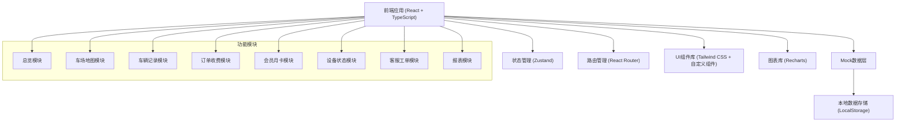

## 1. 架构设计



## 2. 技术栈描述

- **前端框架**: React@18 + TypeScript
- **构建工具**: Vite@5
- **样式方案**: Tailwind CSS@3
- **路由管理**: react-router-dom@6
- **状态管理**: zustand@4
- **图表可视化**: recharts@2
- **图标库**: lucide-react
- **日期处理**: date-fns
- **后端**: 纯前端 Mock 数据，使用 LocalStorage 持久化

## 3. 路由定义

| 路由 | 页面 | 说明 |
|------|------|------|
| / | 总览 | 系统首页，数据概览 |
| /map | 车场地图 | 车位分布可视化 |
| /vehicles | 车辆记录 | 入出场记录管理 |
| /orders | 订单收费 | 订单与收费管理 |
| /members | 会员月卡 | 会员与月卡管理 |
| /devices | 设备状态 | 设备监控与控制 |
| /tickets | 客服工单 | 工单处理系统 |
| /reports | 报表 | 数据分析报表 |

## 4. 数据模型定义

### 4.1 核心类型定义

```typescript
// 车位状态
interface ParkingSpot {
  id: string;
  spotNumber: string;
  zone: string;
  floor: string;
  status: 'available' | 'occupied' | 'reserved' | 'disabled';
  vehiclePlate?: string;
}

// 车辆记录
interface VehicleRecord {
  id: string;
  plateNumber: string;
  entryTime: string;
  exitTime?: string;
  status: 'parking' | 'exited';
  entryImage?: string;
  exitImage?: string;
  isUnlicensed: boolean;
  correctedPlate?: string;
}

// 订单
interface Order {
  id: string;
  plateNumber: string;
  entryTime: string;
  exitTime: string;
  duration: number; // 分钟
  totalAmount: number;
  discountAmount: number;
  paidAmount: number;
  status: 'pending' | 'paid' | 'refunded' | 'abnormal';
  couponCode?: string;
  invoiceRequested: boolean;
  remark?: string;
}

// 会员
interface Member {
  id: string;
  name: string;
  phone: string;
  plateNumber: string;
  cardType: 'monthly' | 'quarterly' | 'yearly';
  expireDate: string;
  status: 'active' | 'expired' | 'blacklisted';
}

// 设备
interface Device {
  id: string;
  name: string;
  type: 'gate' | 'camera';
  location: string;
  status: 'online' | 'offline' | 'fault';
  lastHeartbeat: string;
}

// 工单
interface Ticket {
  id: string;
  title: string;
  description: string;
  type: 'complaint' | 'consult' | 'fault' | 'other';
  status: 'pending' | 'processing' | 'resolved' | 'closed';
  priority: 'low' | 'medium' | 'high';
  assignee: string;
  creator: string;
  createdAt: string;
  updatedAt: string;
  history: TicketHistory[];
}

interface TicketHistory {
  id: string;
  action: string;
  operator: string;
  remark: string;
  timestamp: string;
}
```

## 5. 目录结构

```
src/
├── components/          # 公共组件
│   ├── Layout/          # 布局组件
│   │   ├── Sidebar.tsx  # 侧边栏
│   │   ├── Header.tsx   # 顶部导航
│   │   └── index.tsx    # 主布局
│   ├── DataCard.tsx     # 数据卡片
│   ├── StatusBadge.tsx  # 状态标签
│   ├── Modal.tsx        # 模态框
│   └── Table/           # 表格组件
├── pages/               # 页面组件
│   ├── Dashboard/       # 总览页
│   ├── ParkingMap/      # 车场地图
│   ├── Vehicles/        # 车辆记录
│   ├── Orders/          # 订单收费
│   ├── Members/         # 会员月卡
│   ├── Devices/         # 设备状态
│   ├── Tickets/         # 客服工单
│   └── Reports/         # 报表
├── store/               # 状态管理
│   └── useParkingStore.ts
├── types/               # 类型定义
│   └── index.ts
├── utils/               # 工具函数
│   ├── mock.ts          # Mock 数据生成
│   ├── format.ts        # 格式化函数
│   └── constants.ts     # 常量定义
├── App.tsx              # 应用入口
├── main.tsx             # 渲染入口
└── index.css            # 全局样式
```

## 6. 设计规范

### 6.1 颜色变量
```css
:root {
  --primary: #0F3460;
  --primary-light: #1a4a7a;
  --success: #16C79A;
  --warning: #FF6B35;
  --danger: #E94560;
  --bg-dark: #1A1A2E;
  --bg-card: #16213E;
  --text-primary: #FFFFFF;
  --text-secondary: #94A3B8;
  --border-color: #334155;
}
```

### 6.2 间距系统
- 基础单位: 4px
- 常用间距: 4, 8, 12, 16, 20, 24, 32, 48 px

### 6.3 字体层级
- 超大标题: 28px / 700
- 页面标题: 20px / 600
- 卡片标题: 16px / 600
- 正文: 14px / 400
- 辅助文字: 12px / 400
